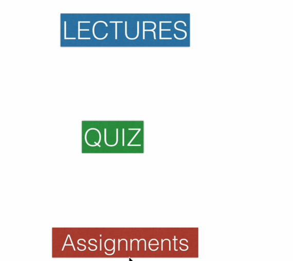
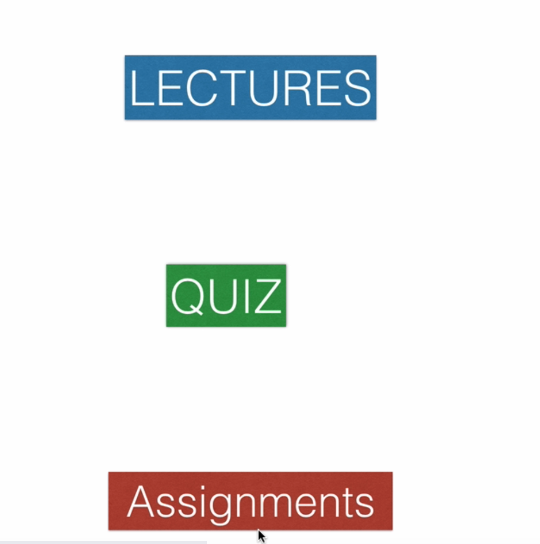
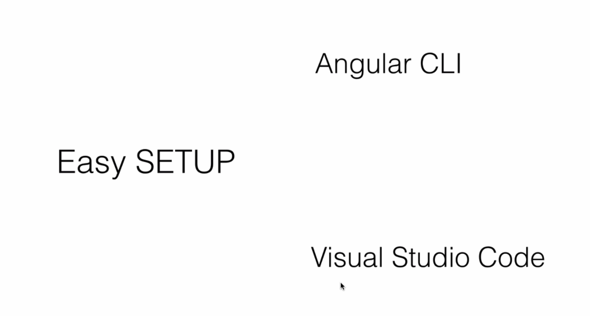
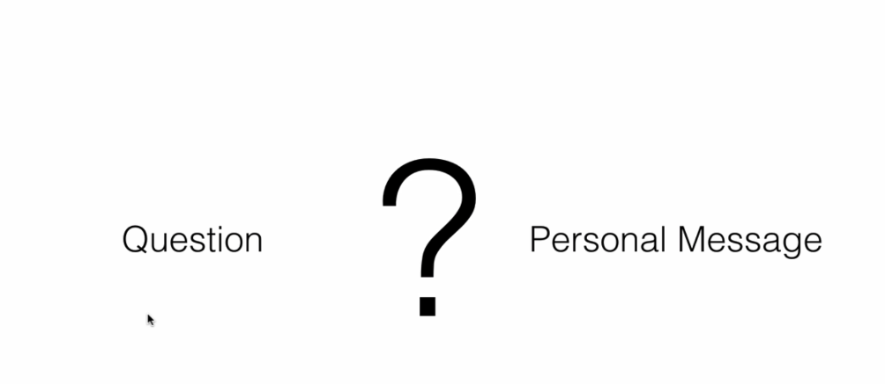
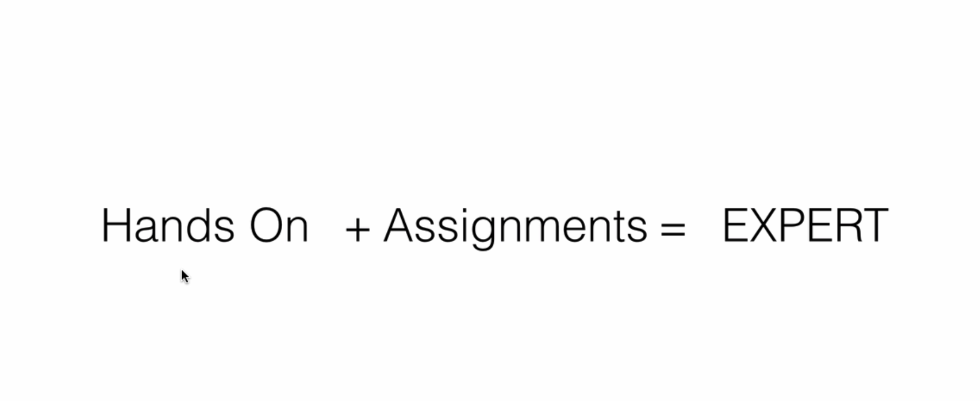
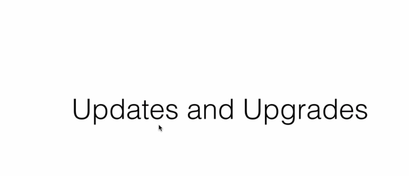

# Angular Crash Course Organization

Welcome to the Angular crash course! This guide explains how the course is organized to help you get the maximum benefit.

## Quick Summary

- Course divided into sections with short, focused lectures
- Quizzes and assignments at the end of most sections
- Hands-on approach with practical exercises
- Software setup covered in dedicated section
- Q&A support available throughout
- Continuous updates with latest Angular versions

## Course Structure

| Topic | Image |
|---|---|
| **Course Welcome & Organization**  Welcome to the Angular crash course. This course is well organized to help you make the maximum out of it. Each section is designed to build your skills progressively. |  |
| **Sections & Lectures**  This course is divided into sections and each section has short and to the point lectures. At the end of most sections you'll find quizzes and assignments that help you evaluate the knowledge gained. Work on assignments as soon as you finish each section. |  |
| **Software Setup**  You'll be installing Angular CLI and using Visual Studio Code for hands-on lectures throughout the course. Setup is covered in the easy software setup section. You'll also install NodeJS, ExpressJS, and Java as required in later sections. |  |
| **Q&A Support**  At any point, if you have questions you can post them under the Q&A section. I'm very quick at responding to questions. If there's a delay, send a personal message. Get into the habit of answering other students' questions - it's a great way to share and learn. |  |
| **Hands-on Learning**  This is a complete hands-on course with tons of practical lectures and assignments. To become an expert in Angular, work on all hands-on lectures along with me and complete the assignments for review. |  |
| **Course Updates**  I'll be continuously updating the course and upgrading it with the latest version topics. Keep me posted with your feedback and suggestions. |  |
| **Get Started**  Now get started and keep me posted with your feedback and questions. Remember, I am always here to support you throughout your learning journey. |  |