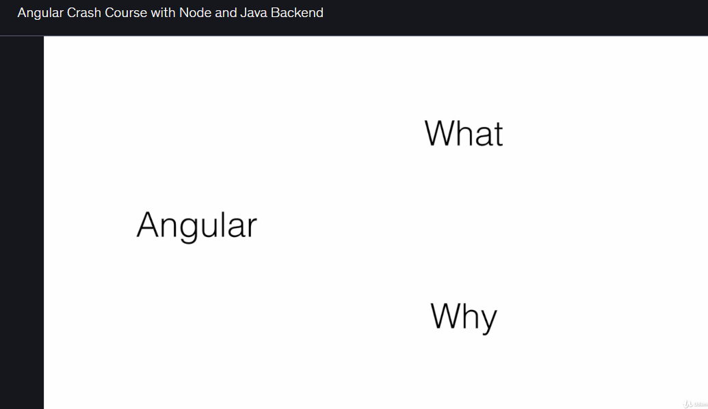
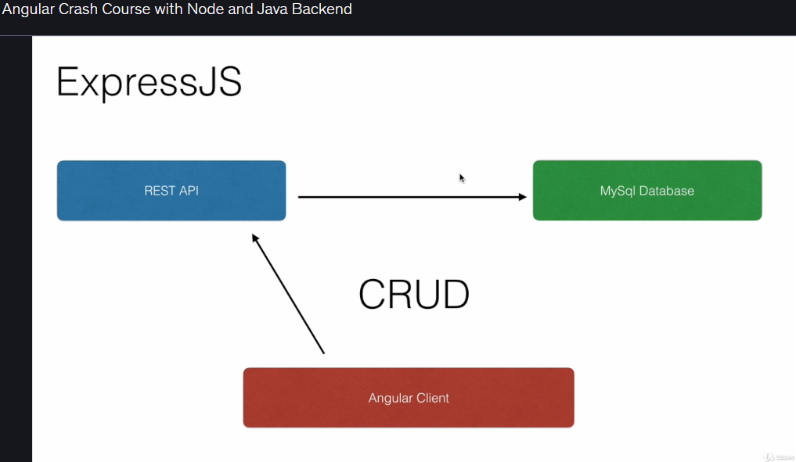
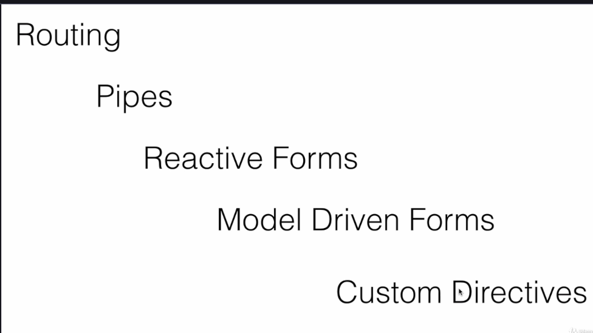

# Chapter 1 — Detailed Notes

This document contains expanded, formatted notes for Chapter 1. Each row pairs a detailed paragraph on the left with the corresponding image on the right.

| Detailed notes | Image |
|---|---:|
| **Introduction to Single Page Applications (SPA) & Angular**

Single Page Applications (SPAs) load a single HTML page and dynamically update the view as the user interacts with the app. SPAs reduce page reloads and provide smoother user experiences. Angular is a robust frontend framework built around components, dependency injection, and reactive programming patterns. It offers a structured approach to building SPAs with features such as declarative templates, routing, and built-in support for form handling and HTTP communication. |  |
| **Setup: Angular CLI & Visual Studio Code**

The Angular CLI is the recommended tool to scaffold, build, and serve Angular applications. It standardizes project structure and automates common tasks (generate components, services, modules). Visual Studio Code is a lightweight, extensible editor with TypeScript/Angular extensions, integrated terminal, and debugging support—ideal for hands-on lessons. Ensure Node.js and npm are installed before installing the CLI (`npm install -g @angular/cli`). |  |
| **Components & Project Structure**

Components are the fundamental building blocks of an Angular app. Each component encapsulates a template (HTML), presentation logic (TypeScript), and styles (CSS/SCSS). Understanding the Angular module system, the component lifecycle hooks, and folder organization (src/app, assets, environments) is critical. You will create your first project and component, inspect the generated files, and learn how components communicate via @Input and @Output bindings. |  |
| **Directives: built-in UI logic**

Directives allow DOM manipulation and dynamic behavior without changing component templates manually. Structural directives like *ngIf and *ngFor control the DOM layout, while attribute directives like [ngStyle] and [ngClass] change appearance. Learning how and when to use these directives leads to cleaner templates and reusable UI patterns. |  |
| **Services & HTTP Communication**

Services encapsulate shared logic and data access. Use Angular services for HTTP calls, state management, and business logic. The HttpClient service simplifies RESTful requests and supports observables for reactive data streams. You will implement multiple services in components and learn best practices for subscribing, error handling, and cleanup (unsubscribe or async pipe). |  |
| **Building a RESTful API with Node.js & Express**

To practice end-to-end integration, you will build a RESTful API using Express and Node.js that performs CRUD operations against a database (e.g., SQLite, PostgreSQL, or MongoDB). The API exposes endpoints consumed by the Angular client. This exercise covers routing, middleware, controllers, data persistence, and basic error handling. |  |
| **Routing, Pipes, Forms & Custom Directives**

Routing enables navigation between views with route parameters, lazy loading, and guards. Pipes format data in templates (date, currency, custom transforms). Forms can be built as template-driven (NgModel) or reactive (FormGroup/FormControl) depending on complexity; reactive forms are preferred for complex validation and dynamic controls. You will also create custom directives and pipes to encapsulate reusable UI behaviors. |  |
| **Final Project: Flight Reservation & CheckIn**

The capstone integrates all course concepts: a Java Spring backend exposes RESTful endpoints, while two Angular microfrontends (Flight Reservation and Flight CheckIn) consume those APIs. The Reservation app handles booking flows; the CheckIn app lets passengers check in for flights. This demonstrates multi-project architecture, API reuse, and real-world integration patterns. |  |
