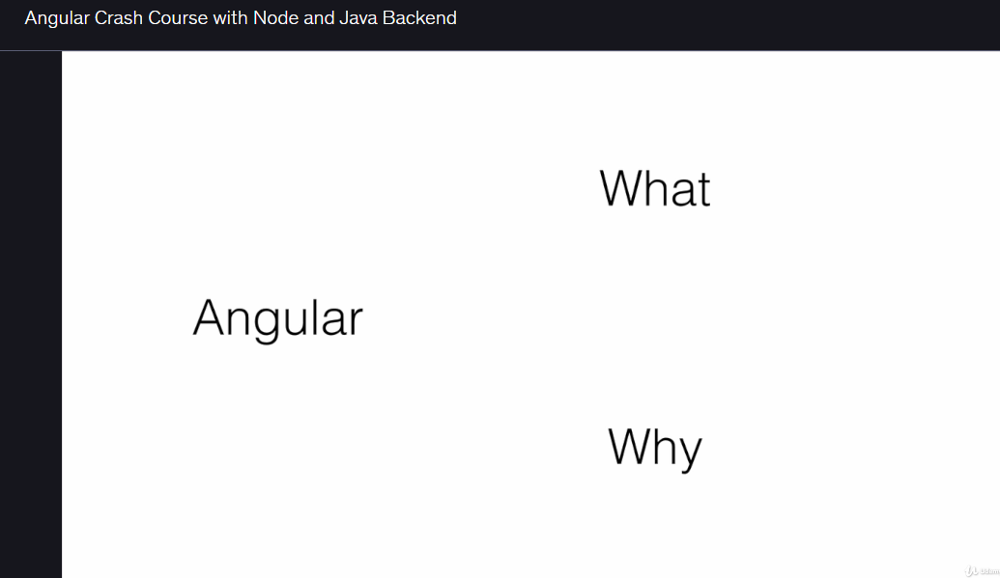
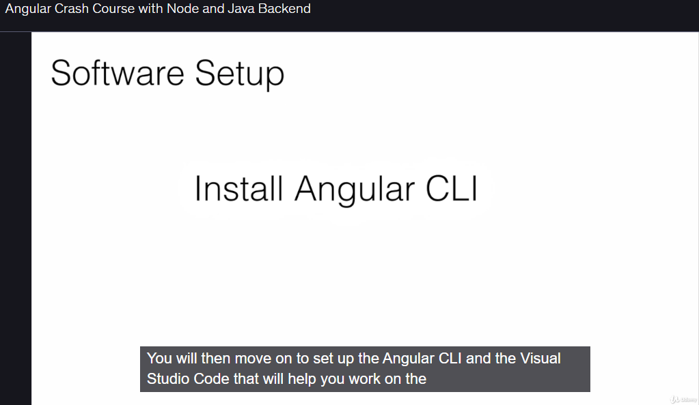
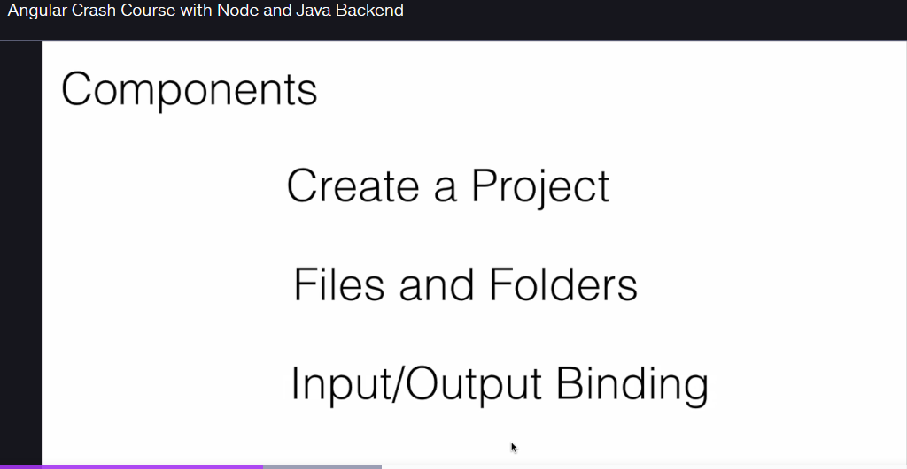
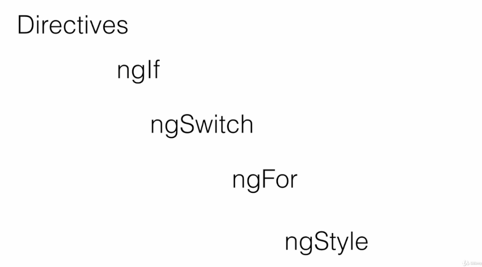
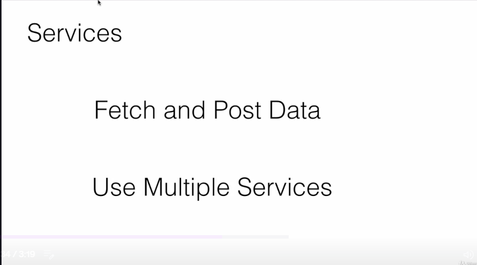
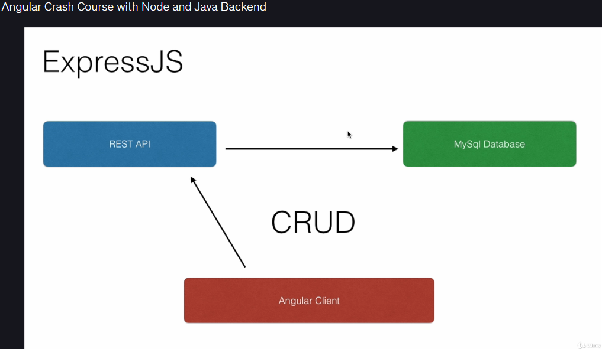
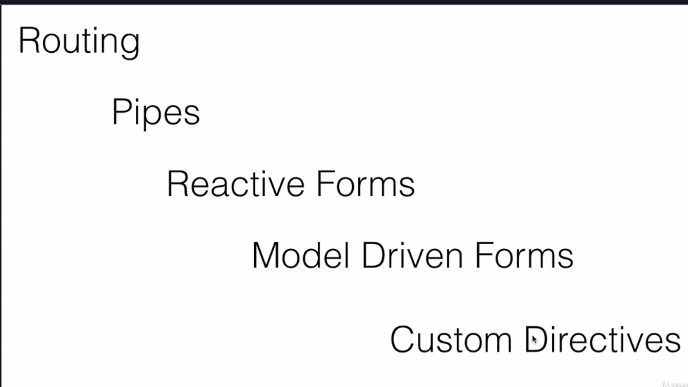
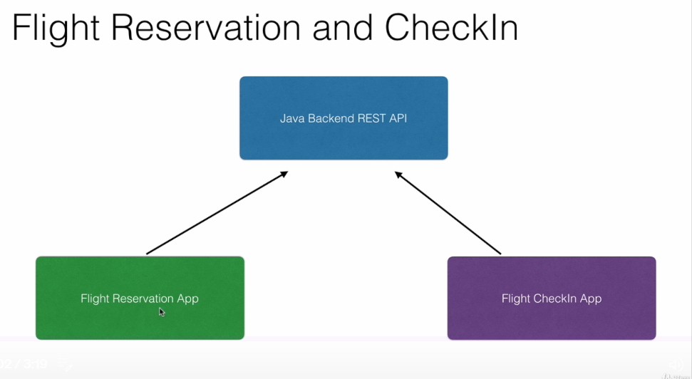

# Chapter 1 — Summary (Quick Notes)

> 📖 **Want more details?** [Click here to view the detailed notes](detailed-notes.md)

Quick bullet summary:

- Introduction to Single Page Applications (SPA) and why Angular is popular for SPAs.
- Setup: install and configure Angular CLI and Visual Studio Code for hands-on work.
- Components: create your first Angular project and component; learn component files and folders.
- Data binding: use input (property) binding and output (event) binding.
- Directives: use built-in directives (ngIf, ngSwitch, ngFor, ngStyle, etc.) to add logic to UIs.
- Services & HTTP: use services to fetch/post data; combine multiple services in a component.
- REST APIs: consume public RESTful APIs; build your own REST API with Node.js + Express for CRUD.
- Routing, Pipes, Forms: implement routing, use pipes, build reactive & template-driven forms, create custom directives.
- Final project: Flight Reservation & CheckIn use case — Java Spring backend + two Angular microfrontends (Reservation and CheckIn).

Table: topic summary (left) and corresponding image (right)

| Topic / Short description | Image |
|---|---:|
| Intro to SPA & Angular |  |
| Setup: Angular CLI & VS Code |  |
| Components & core files |  |
| Directives (ngIf, ngFor, etc.) |  |
| Services & HTTP calls |  |
| Build RESTful API with Node/Express |  |
| Routing, Pipes, Forms, Custom Directives |  |
| Final project: Flight Reservation & CheckIn (Java backend + 2 Angular apps) |  |

---

📚 **[View Detailed Notes →](detailed-notes.md)**