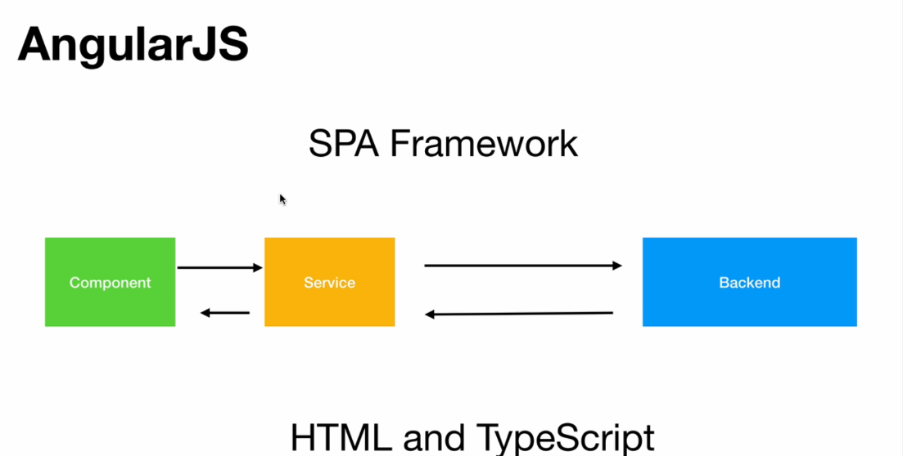
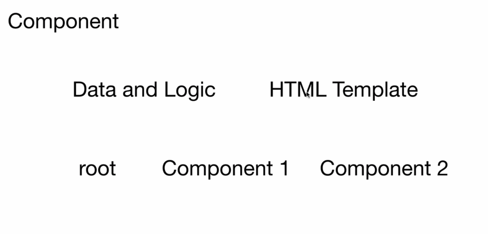
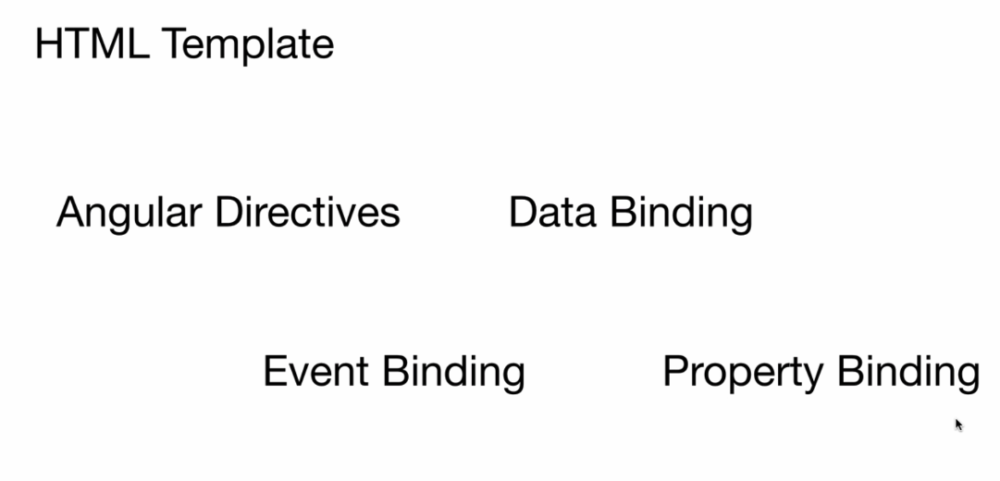
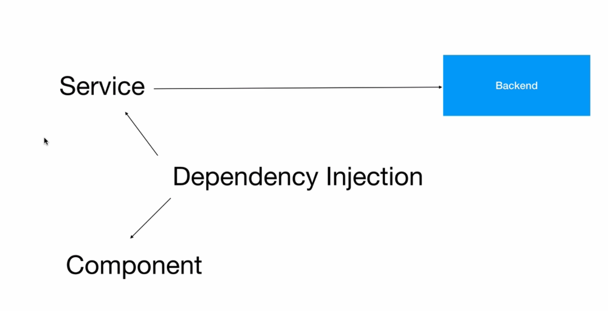
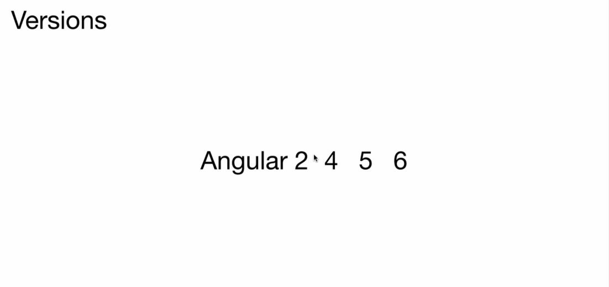

Slide 1:
In this lecture, you will learn what AngularJS is and why we should use it.

Slide 2:
AngularJS is a single page

application development framework or platform that is built using HTML and TypeScript.

The reason for angular's popularity comes from its architectural features that it has to offer, using

which we can build single page applications quickly and easily.

Slide 3:
The first of those architectural features is the component.

Every angular application is made up of atleast one component. A component is a combination of data and

logic and associated HTML template that renders that data using the logic onto the web browser.

Every application will have a root component followed by several other components to render the different

parts of our application on to the browser.
| Slide | Image |
|---|---:|
| **Slide 1**

In this lecture, you will learn what AngularJS is and why we should use it.
 |  |
| **Slide 2**

AngularJS is a single-page application development framework built using HTML and TypeScript. Its popularity comes from architectural features that let you build SPAs quickly and maintainably.
 |  |
| **Slide 3**

Components are the core building blocks of an Angular application. A component combines data, logic, and an HTML template to render a portion of the UI. Applications have a root component and many child components to render different views.
 |  |
| **Slide 4**

Templates use directives and data binding to add dynamic behavior. Structural directives (like *ngIf/*ngFor) change DOM structure; attribute directives and property/event binding connect component data and UI events.
 |  |
| **Slide 5**

Services encapsulate shared logic such as HTTP calls. Use dependency injection to provide services to components so they can fetch and render data.
 |  |
| **Slide 6**

Routing maps URL paths to views. Navigation (links, buttons, browser back) is handled by the router so SPAs behave like multi-page apps without full page reloads.
 |  |
| **Slide 7**

Angular versions: Angular 2 was a major rewrite from AngularJS (1.x); later versions (4,5,6...) are incremental upgrades. Focus on current stable versions and migration paths.
 |  |
| **Summary**

Angular's component model, directives, services with DI, and routing make it a strong choice for building maintainable SPAs.
 |  |