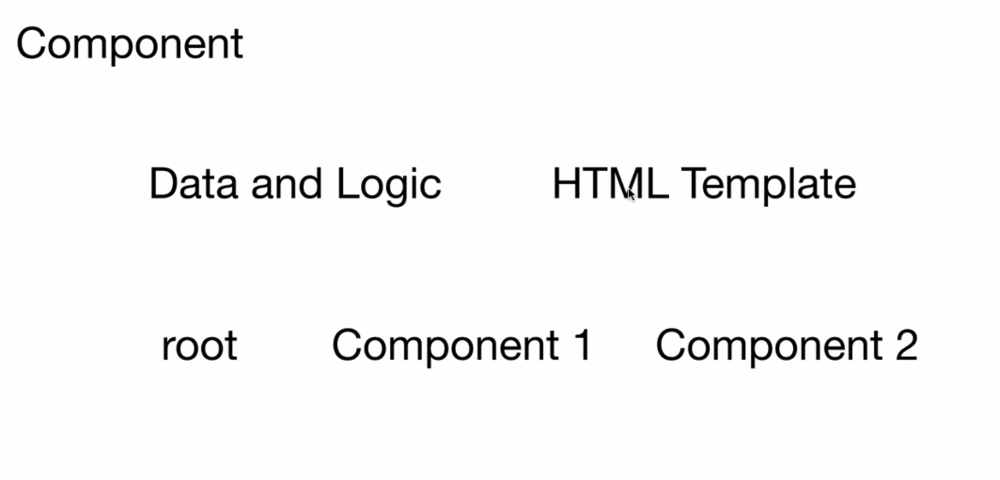

# Chapter 3 — Summary (Quick Notes)

Quick bullet summary:

- What is AngularJS and why use it.
- Angular as a single-page application (SPA) framework using HTML + TypeScript.
- Components: structure, root component, and child components.
- Templates: directives and data binding (property & event binding).
- Services & Dependency Injection: fetch and share data via services.
- Routing: map URL paths to views to enable SPA navigation.
- Versions: Angular 2+ are the modern stack; AngularJS (1.x) is legacy.

Table: topic summary (left) and corresponding image (right)

| Topic / Short description | Image |
|---|---:|
| Intro: What is AngularJS |  |
| Angular as SPA (HTML + TypeScript) |  |
| Components & Project Structure |  |
| Templates, Directives & Binding |  |
| Services & Dependency Injection |  |
| Routing & Navigation |  |
| Angular Versions (2+) |  |

---

📚 **[View Detailed Notes →](detailed-notes.md)**
